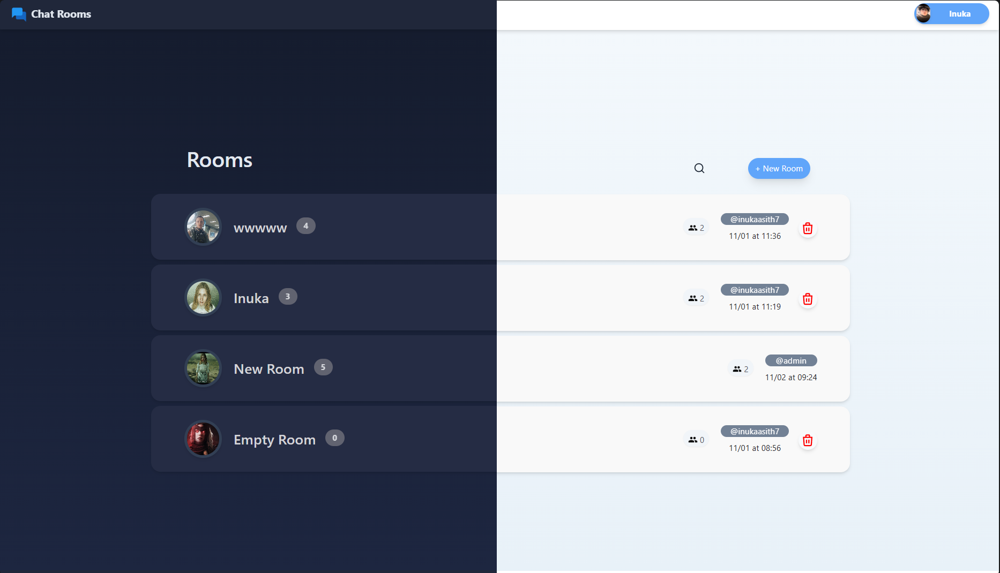
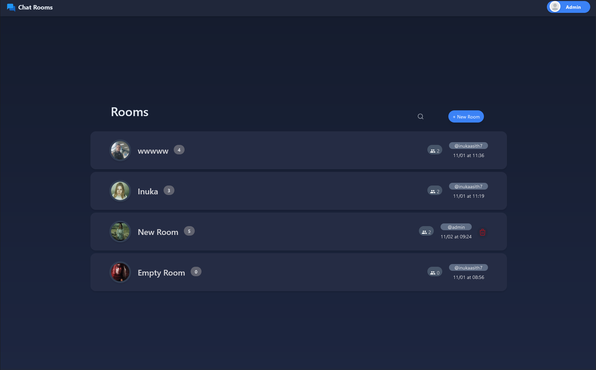
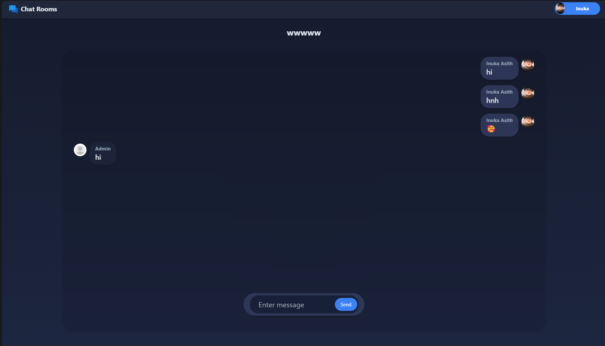
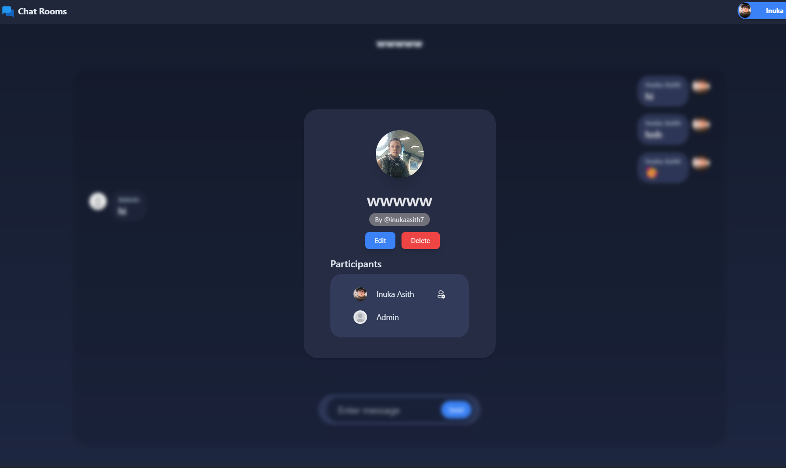
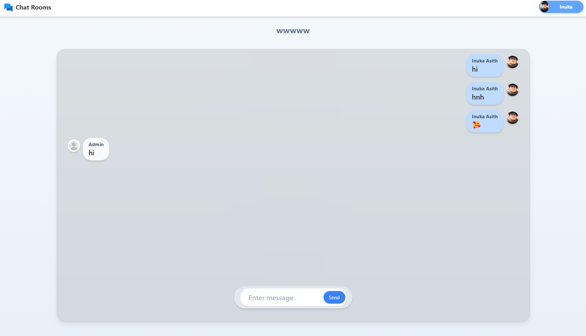

# 🚀 Chat Rooms - A Real-Time Chat App (CS50 Fiinal Project)


<details>
  <summary>Expand for more images</summary>
  
  
  
  
  
  
</details>

## Live Demo: [chatrooms-demo.vercel.app](https://chatrooms-demo.vercel.app)
#### Due to limitations of vercel realtime message fetching (socketio) won't work on demo. Also otp verification is disabled on demo (I don't have a way to send emails for free)

# Details:

Chat Rooms is a real-time chat website featuring a modern UI with both dark and light themes. It offers seamless communication and prioritizes user privacy and effective community management.

Supports unlimited number of users with email verifications admin system user bans and much more. 


### Video Demo: [Watch Here](https://youtu.be/gefUGwatrZs)

## ✨ Key Features

### 👥 User Management & Security
- **Robust Authentication System**
  - Secure account creation with email verification
  - Password strength requirements and recovery options
  - Password salting, hashing, csrf_token and security
  - Session management with automatic timeout
  - Account deletion with data cleanup

- **Comprehensive Profile System**
  - Customizable user profiles with bio and interests
  - Profile picture upload and management via Cloudinary

### 💬 Chat Room Features
- **Room Management**
  - Create public chat rooms
  - Customizable room settings (name, profile picture)
  - View participants

- **Interactive Messaging**
  - Real-time message delivery using Socket.io
  - Message deletion and moderation
  - Multiple user support


### 🛡️ Moderation Tools
- **Room Administration**

    - Room creators have full control
    - Ability to appoint multiple moderators
    - Ban management system
    - Message deletion


### 🔄 Real-Time Features
- **Socket.io Integration**
  - Instant message delivery
  - Room creation and deletion


## 🛠️ Technical Stats

### Backend

- **Flask Framework and tools used**
  - Flask mail for mail
  - Scalable routing system
  - Custom user model with auth blueprint
  - Error handling and logging

- **Database**
  - PostgreSQL or sqlite3 support.
  - Used SQLALchemy ORM for efficient and scalable database model.
  - Database migrations with flask-migrate

### Frontend

I didn't use any frameworks here. Tried my best to make site modern and cool. Some parts are redundant. Need to learn and use a frontend framework

- **Styling**
  - Tailwind CSS for modern UI
  - Dark/light mode toggle
  - Responsive UI for any screen size

### Infrastructure
- **Authentication & Authorization**
  - Flask-Login for session management
  - JWT token implementation
  - Role-based access control
  - Flask mail used to send emails.
  - flask-security implemented
  - Using hashing and salting from itsdangerous

- **Websockets**
  - Using websockets for real time message delivery and room updates
  - ALl side menus rooms and chats supportt real time message delivery and deletions

- **File Storage**
  - Cloudinary integration for photo uploads
  - Secure file handling
  - Multiple format support

- **Forms and Inputs**
  - Used wtforms for validations and scalability
  - Used json based api's to implement no-reload menu's as much as possible
  - used csrf_tokens for secure post requests

## 🚀 How to run

### Prerequisites
```bash
# Required software
- Python 3.8+
- Node.js 14+
- PostgreSQL 12+
```

### Installation Steps

1. **Clone the Repository**
   ```bash
   git clone https://github.com/yourusername/chat-rooms.git
   cd chat-rooms
   ```

2. **Set Up Virtual Environment**
   ```bash
   python -m venv venv
   source venv/bin/activate  # On Windows: venv\Scripts\activate
   ```

3. **Install Dependencies**
   ```bash
   # Backend dependencies
   pip install -r requirements.txt
   
   ```

4. **Configure Environment variables**
   ```bash
   # Edit add environmental variables to os
   # - Database credentials
   # - Cloudinary API keys
   # - Mail server settings

   MAIL_USERNAME='',  
   MAIL_PASSWORD='',
   SECRET_KEY='',
   DATABASE_URI=''

   ```

5. **Initialize Database**
   ```bash
   flask db upgrade
   ```

6. **Start Development Servers**
   ```bash
   # Start backend (from root directory)
   flask run

   ```

7. **Access Application**
   -  http://localhost:5000


## 📁 Project Structure
```
└── Chatrooms/
    ├── README.md 
    ├── app.py 
    | (Main Flask application. Handles index page, rooms, bans, chat    admins etc..)
    ├── auth 
    |   (Blueprint to handle authentication and authorization)
    │   ├── forms.py 
        |   (Handles forms related to auth blueprint, such as login and registration forms)
    │   ├── models.py
    |   |  (Defines database models for authentication and authorization)
    │   ├── routes.py
    |   |  (Defines routes for authentication and authorization, such as login and logout)
    │   └── templates 
    |      |  (Templates for authentication and authorization pages)
    │      ├── account_delete.html 
    │      ├── dashboard.html  
    |      |  (Template for user dashboard page)
    │      ├── edit_user.html 
    │      ├── login.html 
    │      ├── otp.html 
    │      ├── password_reset.html 
    │      ├── register.html 
    │      ├── reset_password.html 
    │      ├── verification_email.html 
    |         (Template for email verification email)
    ├── forms.py 
    |   (Handles forms for the main application, such as room creation and editing)
    ├── models.py 
    |   (Defines database models for the main application, such as rooms and admins. Extends from auth.models)
    ├── package.json (tailwind css setup)
    ├── requirements.txt 
    |   (Dependencies for the Python application)
    ├── static (Static assets, such as images and CSS files)
    │   ├── Nothing.png (Image for unknown or missing content)
    │   ├── admin.png (Image for admin users)
    │   ├── error.png (Image for error pages)
    │   ├── icon.png (Image for the application icon)
    │   ├── input.css (tailwind css setup) 
    │   ├── output.css (tailwind css setup)
    │   ├── participants.png (Image for participants in a room)
    │   ├── unknown_chat.png (Image for unknown or missing chat content)
    │   └── unknown_user.jpg (Image for unknown or missing user content)
    ├── tailwind.config.js 
    |   (Configuration for Tailwind CSS, dark mode setup)
    ├── templates
    |   |  (Templates for the main application pages)
    │   ├── add_admin.html 
    |   |  (Template for adding an admin to a room)
    │   ├── ban_user.html 
    |   |  (Template for banning a user from a room)
    │   ├── chat.html 
    |   |  (Template for the chat interface. Handles scripts of rooms_sidebar, chat_info)
    │   ├── chat_info.html 
    |   |  (Template for displaying chat information)
    │   ├── create_room.html 
    |   |  (Template for creating a new room)
    │   ├── edit_room.html 
    |   |  (Template for editing an existing room)
    │   ├── errorpage.html 
    |   |  (Template for error pages)
    │   ├── index.html 
    |   |  (Template for the main index page)
    │   ├── layout.html 
    |   |  (Template for the overall layout of the application, handles scripts of preferences_pane, flash messages, dark mode handled by class on body wrapper)
    │   ├── preferences_pane.html 
    |   |  (Template for the preferences panel top right corner)
    │   ├── profile.html 
    |   |  (Template for displaying user info)
    │   ├── right_click_menu.html (
    |   |  Template for the right-click menu)
    │   ├── rooms.html 
    |   |  (Template for displaying a list of rooms. a block reusable)
    │   ├── rooms_sidebar.html 
    |   |  (Template for the rooms sidebar. scripts handled by chat.html. handles scripts from chat_info.html)
    │   
    ├── tests (Unit tests for the application)
    │   └── test_rooms.py (#TODO Unit tests for the rooms functionality. Gave up halfway. Not complete)
    ├── upload.py (Script for uploading files to the web or saving on server)
    └── vercel.json (Configuration for Vercel if deploying to vercel)
```

## TODO:

- Rewrite backend in more scallable framework (I'm already converting to django)
- Refactor the current HTML templates to use a frontend framework like React or Vue.js.
- Convert each template (e.g., `chat.html`, `rooms_sidebar.html`) into components.
- Ensure components are modular and reusable
- Implementing reply messages
- Implement send media on chats.
- Implement end-to-end encryption

## 🙏🏻 Credits:
- [Icons8](https://icons8.com/) for the icons used in the application
- [ChatGPT](https://chat.openai.com/) for helping with writing the README, comments and error fixing suggestions
- TailwindCSS and flask documentation

### Special thanks for  [CS50](cs50.harvard.edu) for giving amazing cs50x for free.. 😊
